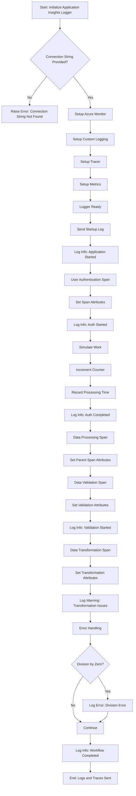

# Azure Application Insights Logger

This Python application demonstrates how to integrate and send logs, traces, and custom metrics to Azure Application Insights using OpenTelemetry and the Azure Monitor exporter.

## Features

- **Custom logging** with Python's built-in logging module
- **Trace spans** to track distributed operations
- **Custom metrics** for request counts and processing time
- **Manual Azure Monitor setup** with INFO log level support

## Application Insight Logs Screenshot


## Flow Architecture



## Prerequisites

- Python 3.7 or newer
- Azure Application Insights resource with connection string
- Install dependencies with:
    ```bash
    pip install -r requirements.txt
    ```

## Setup

1. Set the environment variable for connection string:
    ```
   export APPLICATION_INSIGHTS_CONNECTION_STRING="<your_connection_string_here>"
   ```

2. Run the application:
    ```
   python app_insights_logger.py
   ```


## Usage

- The logger sends sample logs, including various severity levels (DEBUG, INFO, WARNING, ERROR, CRITICAL).
- Sends custom trace spans for user authentication and data processing.
- Records custom metrics for requests and processing duration.
- Errors such as division by zero are logged with details.

## Verify Logs

- Check Azure Portal > Application Insights > Logs.
- Use KQL queries to explore traces, metrics, and custom dimensions.

## Files

- `app_insights_logger.py` - Main application script
- `requirements.txt` - Python dependencies

## Notes

- Logs at INFO level and above are captured.
- Ensure your connection string is valid and has proper permissions.
- The manual logger setup enables better control over log levels.

## License

[MIT License](LICENSE)